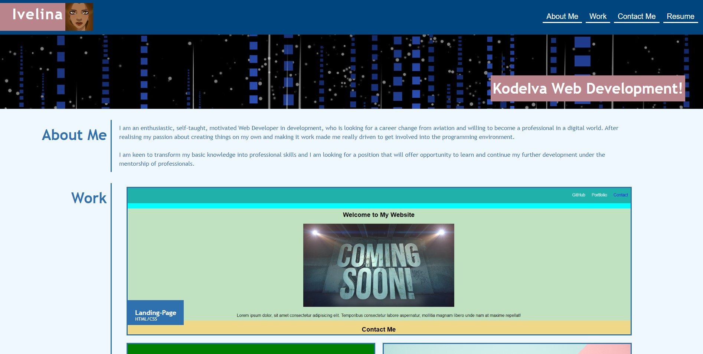
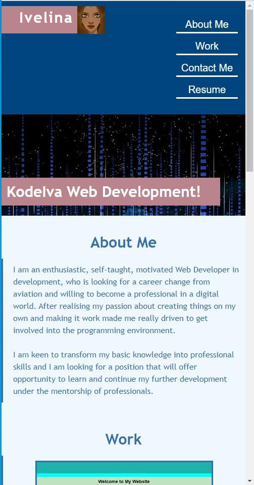
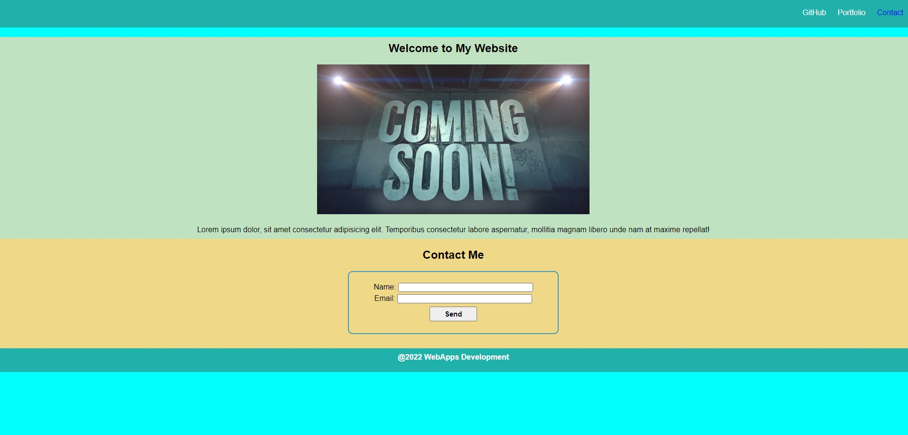

# Portfolio2

## Description
The Portfolio project I created is to represent myself to the future employers. It includes examples of other smaller projects to show my web development skills. 


## Screenshots

### Wide Screen



### Mobile Screen




## Links

- Solution URL: [Solution URL here](https://github.com/KodeIva/Portfolio2)
- Live Site URL: [Live site URL here](https://kodeiva.github.io/Portfolio2/)


## Codes used

- Semantic HTML5 markup
- CSS custom properties
- Flexbox
- CSS Grid

### Header
```html
<header>
  <h1>Ivelina</h1>
  
  <nav>
   <ul>
    <li><a href="#about">About Me</a></li>
    <li><a href="#work">Work</a></li>
    <li><a href="#contact">Contact Me</a></li>
    <li><a href="#work">Resume</a></li>
   </ul>
  </nav>
 </header>
```
### Hero
```html
<section class="hero-banner">
  <div>
   <h2>KodeIva Web Development!</h2>
   
  </div>
 </section>
```

### Portfolio section example
```html
<div id="portfolio-1">
 <h4>Landing-Page</h4>
  <p>HTML/CSS</p>
  <a href="https://kodeiva.github.io/Landing-Page/" target="_blank">
   
  </a>
</div>
```

### Grid
```css
.container {
  border-left: 3px solid #2F70AF;;
  width: 75%;
  padding: 10px 40px;
  display: grid;
  grid-template-columns: 50% 50%;
  grid-template-rows: 400px 250px 250px;
  gap: 20px;
  grid-template-areas:
  "portfolio-1 portfolio-1"
  "portfolio-2 portfolio-3"
  "portfolio-4 horiseon"
  ;
}
```

## Installation

 N/A


## Credits

N/A


## License
[MIT](https://choosealicense.com/licenses/mit/)
